  
  <!-- dynamic typing effect 动态打字效果 -->
  

    
  

  <!-- knock code pictures 敲代码的图片 -->
   

  <!-- profile logo 个人资料徽标 -->
  

    &emsp;
    <!-- visitor statistics logo 访问量统计徽标 -->
    
  

#  🙋 Hello

<table>
<tr><td>

<!-- About me 关于我 -->
### 🤺 About Me

&emsp;&emsp;大家好，我是Zyx

&emsp;&emsp;热爱摄影、旅行。

&emsp;&emsp;热爱计算机科学和IT互联网事业，励志成为一名优秀的开发者。

&emsp;&emsp;我们正在让这个世界变得更加美好，通过代码的重复使用和延展构建完美体系。

<strong>&emsp;&emsp;We're making the world a better place. Through constructing elegant hierarchies for maximum code reuse and extensibility.</strong>

</td></tr>

<tr>
<td>
  

<!-- 近期博客 -->
### 📃 Recent Blog
  

<!-- START_SECTION:blog -->
* <a href='https://blog.mczyx.online/%e5%bb%ba%e7%ab%99/%e5%9c%a8%e7%ba%bf%e6%96%87%e6%a1%a3%e7%b3%bb%e7%bb%9f/' target='_blank'>在线文档系统</a> - 2023-08-20
* <a href='https://blog.mczyx.online/%E5%BB%BA%E7%AB%99/%E6%9A%97%E7%BD%91%E7%BD%91%E7%AB%99%E6%90%AD%E5%BB%BA%E5%92%8C%E6%9A%97%E7%BD%91%E5%9F%9F%E5%90%8D%E7%94%B3%E8%AF%B7%E6%96%B9%E6%B3%95/' target='_blank'>暗网网站搭建和暗网域名申请方法</a> - 2023-08-15
* <a href='https://blog.mczyx.online/%e8%bd%af%e4%bb%b6/rustdesk%e9%83%a8%e7%bd%b2%e6%95%99%e7%a8%8b/' target='_blank'>Rustdesk部署教程</a> - 2023-07-18
* <a href='https://blog.mczyx.online/%e7%a7%91%e6%99%ae/%e4%ba%ba%e5%b7%a5%e6%99%ba%e8%83%bd%e7%9a%84%e5%8f%91%e5%b1%95%e5%8e%86%e7%a8%8b%e5%8f%8a%e5%ba%95%e5%b1%82%e5%8e%9f%e7%90%86%e5%88%86%e6%9e%90/' target='_blank'>人工智能的发展历程及底层原理分析</a> - 2023-05-02
* <a href='https://blog.mczyx.online/%e8%bd%af%e4%bb%b6/pixel4%e5%88%b7%e5%85%a5pe%e7%b3%bb%e7%bb%9f/' target='_blank'>Pixel4刷入Pe系统</a> - 2023-01-29
<!-- END_SECTION:blog -->

</td></tr>

<tr><td>

<!-- wakatime 统计 -->
### 📊 WakaTime

<picture>
  <source
    srcset="https://github-readme-stats.vercel.app/api/wakatime?username=Doraizhang&layout=compact&text_color=f0f6fc&bg_color=00000000&hide_border=true&hide_title=true"
    media="(prefers-color-scheme: dark)"
  />
  <source
    srcset="https://github-readme-stats.vercel.app/api/wakatime?username=Doraizhang&layout=compact&text_color=1f2328&bg_color=00000000&hide_border=true&hide_title=true"
    media="(prefers-color-scheme: light), (prefers-color-scheme: no-preference)"
  />
  
</picture>

</td></tr>

<tr><td>

<!--START_SECTION:waka-->

<!--END_SECTION:waka-->
  
</td></tr>
</table>

<!-- ########################################## 分割 ########################################## -->

<!-- just img 图片 -->

<!--  skill badge 技能徽章 -->

```mermaid
mindmap
  root((Zyx))
    编程
      Web开发
      人工智能
    摄影
      风光
      人像
    旅行
      广州
      苏州
      南京
      上海
      北京
      昆明
      香格里拉
      大理
    阅读
      人物传记
      个人成长
      社会文化
      计算机技术
```

💪 正在学习

  
🧠 计划学习

🧰 常用的工具

<!-- programming tool icon 编程工具图标 -->
 

<!-- svg -->

 

 

<!-- gif -->

<!-- ########################################## 分割 ########################################## -->

<!-- just img 图片 -->

